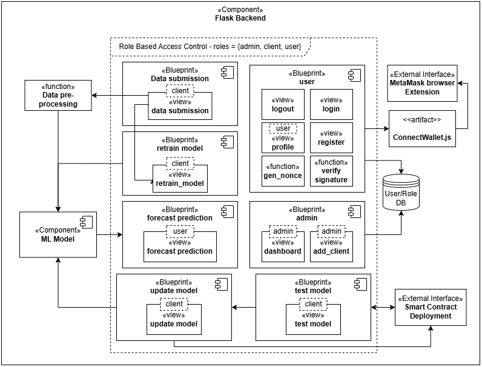

## Figure 2

### Backend component diagram

Component diagram that represents the overall structure of the Flask backend application which enables a user to view and interact with the ML model through the smart contract via the Flask website.
