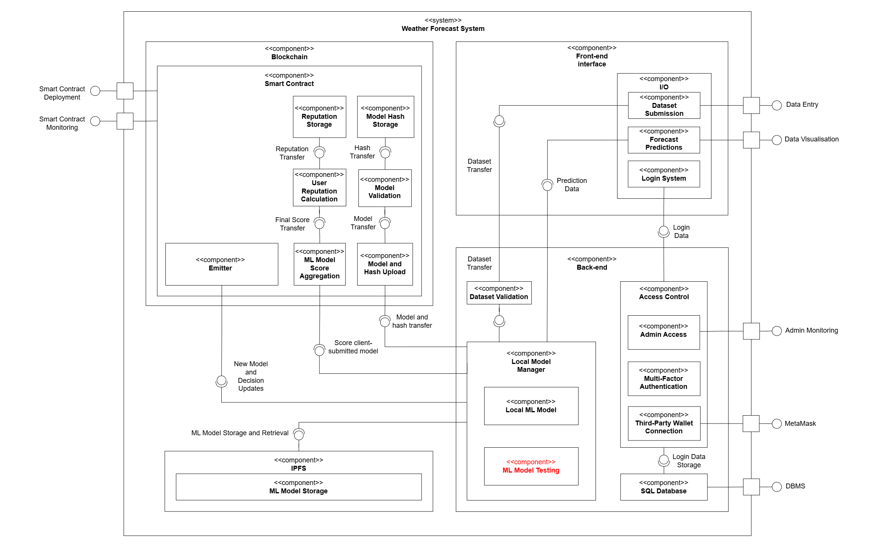

## Figure 1

### System Component Diagram

Overall system component diagram that contains the four key components, and the various connections and interconnections between these components. External interfaces to users, clients, and administrators are shown on the left side of the diagram (smart contract interfaces) and on the right side of the diagram (python-flask interfaces). ML model testing (highlighted in red) is not implemented yet. Within the diagram, circles represent the interfaces provided by a connected component, and sockets represent the interfaces required by a connected component.
---

---
